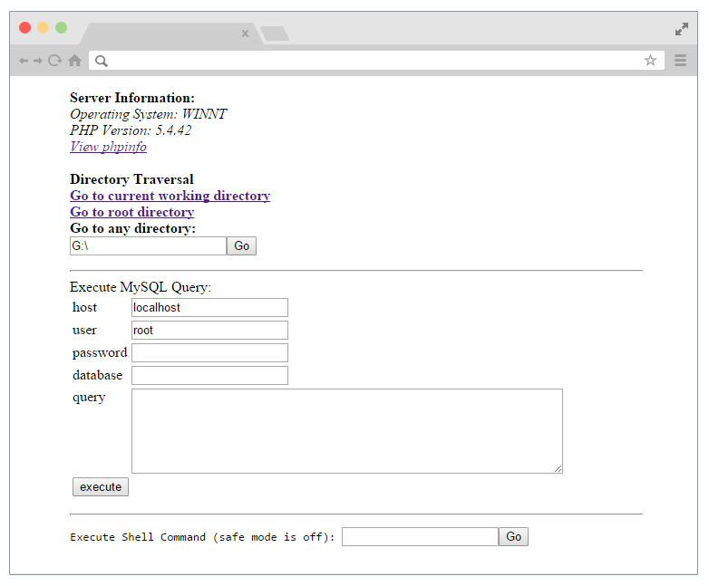

# simple-php-shell

Simple PHP shell script, yet powerful enough.



Features:-

* Display OS type and PHP version
* View phpinfo
* Directory listing and walkthrough
* Upload file to any directory
* GZIP and download folder
* chmod folder to 777
* Highlight DB interaction files in red
* Download, edit and delete a file
* Execute MySQL query
* Execute Shell Command

-----

```
            DO WHAT THE FUCK YOU WANT TO PUBLIC LICENSE
                    Version 2, December 2004

 Copyright (C) 2005 Heiswayi Nrird <hnrird@gmail.com>

 Everyone is permitted to copy and distribute verbatim or modified
 copies of this license document, and changing it is allowed as long
 as the name is changed.

            DO WHAT THE FUCK YOU WANT TO PUBLIC LICENSE
   TERMS AND CONDITIONS FOR COPYING, DISTRIBUTION AND MODIFICATION

  0. You just DO WHAT THE FUCK YOU WANT TO.
```